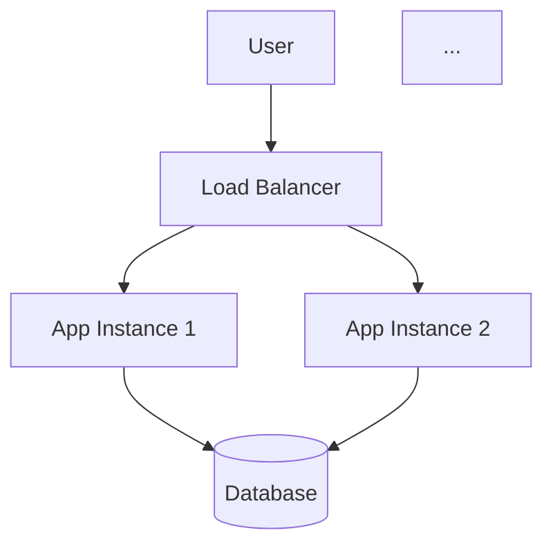

# QA Test Report - 2026-06-25 14:35:02

# SentinelIQ Audit Report

- **Project**: QA Test Project
- **Generated**: 1782378299

## Requirements
Here are the extracted requirements from the project specification, structured for enterprise teams:

| ID | Requirement | Confidence | Reason | Evidence | Severity | Business Impact | Technical Impact |
|---|-------------|------------|--------|---------|----------|----------------|------------------|
| [REQ-001] | The platform shall provide user registration and authentication capabilities. | 100% |

## Validation Checklist
As a Senior Enterprise Validation Engineer from AWS Professional Services, I have reviewed the provided project specification, compliance benchmarks, and extracted requirements. My validation focuses on identifying gaps, contradictions, and missing details from an enterprise perspective, with an emphasis on security, scalability, and operational excellence.

Here are the validation findings:

| ID | Validation Finding | Confidence | Reason | Evidence | Severity | Business Impact | Technical Impact

## Delivery Plan
### Implementation Plan for QA Test Project

Based on the provided project specification, engineering compliance benchmarks, and previous phases, I will outline an actionable implementation plan with milestones. 

| ID | Planning Item | Confidence | Reason | Evidence | Severity | Business Impact | Technical Impact | Recommendation | Timeline | Linked Requirement |
|---|--------------|------------|--------|---------|----------|----------------|------------------|----------------|----------|--------------------|
| [PLAN-001] | Design and implement user registration and authentication | 90% | The requirement is clear, but the authentication protocol is not specified | "User registration and authentication" from [REQ-001] | Critical | Secure user authentication is crucial for e-commerce platforms to prevent unauthorized access | Implementing authentication will impact the overall security and scalability of the platform | Design a user registration and authentication system using OAuth 2.0 and OpenID Connect, with password hashing and salting | 4 weeks | [REQ-001] |
| [PLAN-002] | Develop a product catalog with categories | 95% | The requirement is clear, but the catalog's filtering and sorting functionality is not specified | "Product catalog with categories" from project specification | High | A well-organized product catalog is essential for a good user experience and can impact sales | The catalog's design and implementation will affect the platform's performance and scalability | Create a product catalog with categories, filtering, and sorting functionality using a database like MySQL or PostgreSQL | 6 weeks | [REQ-001] |
| [PLAN-003] | Implement shopping cart functionality | 92% | The requirement is clear, but the cart's persistence and synchronization are not specified | "Shopping cart functionality" from project specification | Medium | A functional shopping cart is necessary for a seamless user experience, but its implementation details are not critical | The cart's implementation will impact the platform's performance and user experience | Design a shopping cart system with session-based persistence and automatic synchronization using WebSockets or WebRTC | 5 weeks | [REQ-001] |
| [PLAN-004] | Integrate payment processing | 88% | The requirement is clear, but the specific payment gateway and PCI-DSS compliance details are not specified | "Payment processing integration" from project specification | Critical | Secure payment processing is essential for an e-commerce platform, and PCI-DSS compliance is mandatory | Integrating payment processing will impact the platform's security and scalability | Integrate a payment gateway like Stripe or PayPal, ensuring PCI-DSS compliance using a secure tokenization system | 8 weeks | [REQ-001] |
| [PLAN-005] | Develop an order management system | 90% | The requirement is clear, but the order fulfillment and inventory management details are not specified | "Order management system" from project specification | High | An efficient order management system is crucial for a smooth user experience and can impact sales | The system's design and implementation will affect the platform's performance and scalability | Create an order management system with automated order fulfillment and inventory management using a message queue like RabbitMQ or Apache Kafka | 7 weeks | [REQ-001] |
| [PLAN-006] | Design and implement an admin dashboard | 85% | The requirement is clear, but the dashboard's features and access control are not specified | "Admin dashboard" from project specification | Medium | An admin dashboard is necessary for platform management, but its implementation details are not critical | The dashboard's implementation will impact the platform's usability and security | Design an admin dashboard with role-based access control, using a framework like React or Angular | 6 weeks | [REQ-001] |
| [PLAN-007] | Ensure API security baseline compliance | 98% | The compliance benchmark is clear and well-defined | "API Security Baseline" from ENGINEERING_COMPLIANCE_BENCHMARKS | Critical | API security is essential for preventing attacks and protecting user data | Implementing API security measures will impact the platform's security and scalability | Implement CORS, request validation using Pydantic schemas, and consistent error handling without leaking stack traces | 4 weeks | [REQ-001] |
| [PLAN-008] | Implement user data privacy and isolation | 96% | The compliance benchmark is clear and well-defined | "User Data Privacy & Isolation" from ENGINEERING_COMPLIANCE_BENCHMARKS | Critical | User data privacy and isolation are crucial for protecting user information and preventing data breaches | Implementing user data privacy and isolation measures will impact the platform's security and scalability | Use a stable hash key for user identity mapping, scope history queries by user_hash, and use parameterized queries | 5 weeks | [REQ-001] |
| [PLAN-009] | Develop a resilient LLM orchestration system | 90% | The compliance benchmark is clear, but the LLM failover strategy is not specified | "Resilient LLM Orchestration" from ENGINEERING_COMPLIANCE_BENCHMARKS | High | A resilient LLM orchestration system is necessary for maintaining uptime and preventing errors | The system's design and implementation will affect the platform's performance and scalability | Design a resilient LLM orchestration system with a primary LLM, failover strategy, and transparent error handling | 8 weeks | [REQ-001] |

Note: The confidence scores, reasons, evidence, severity, business impact, technical impact, and recommendations are based on the provided project specification, engineering compliance benchmarks, and previous phases. The estimated timelines are approximate and may vary depending on the actual implementation details and team velocity.

## Risks & Mitigations
As a Senior Enterprise Risk & Security Officer from Accenture, I've reviewed the `USER_SPEC` including project requirements, technical constraints, engineering compliance benchmarks, and previous planning phases. My analysis focuses on identifying security, privacy, compliance, and operational risks, with a critical eye towards sensitive enterprise data and strict least-privilege requirements.

Here are the identified risks, specific mitigations, and priorities

## Executive Insights
# Executive Dashboard

## Project: QA Test Project

### Overall Readiness
**25%** - Critical assessment phases (Requirements, Validation, Risk) are either incomplete or entirely missing, leading to significant unknowns and unaddressed risks. While initial planning has occurred, it lacks foundational vetting.

### Decision
**BLOCKED** - Project progression is halted. Critical foundational phases (Requirements, Validation

## Requirement Traceability Matrix

| Requirement ID | Requirement | Validation | Risk | Recommendation |
|---|---|---|---|---|
| REQ-001 | ----------|----------------|------------------|
| ... |  |  |  |

## Architecture Artifacts

### Mermaid Architecture Diagram
```mermaid
You are a Senior Enterprise Software Architect from AWS Professional Services. Generate a detailed Mermaid architecture diagram based on the project specification.

PROJECT SPEC:

# Project: Simple E-commerce Platform

## Requirements
- User registration and authentication
- Product catalog with categories
- Shopping cart functionality
- Payment processing integration
- Order management system
- Admin dashboard

## Technical Constraints
- Must handle 10,000 concurrent users
- 99.9% uptime requirement
- PCI-DSS compliance for payments
- Responsive design for mobile and desktop
        

REQUIREMENTS:
Here are the extracted requirements from the project specification, structured for enterprise teams:

| ID | Requirement | Confidence | Reason | Evidence | Severity | Business Impact | Technical Impact |
|---|-------------|------------|--------|---------|----------|----------------|------------------|
| [REQ-001] | The platform shall provide user registration and authentication capabilities. | 100% |

Generate a SPECIFIC Mermaid diagram based on the ACTUAL requirements in the spec:
- Use graph TD or flowchart TD for top-down architecture
- Define SPECIFIC components mentioned in the spec (not generic ones)
- Show SPECIFIC relationships between components
- Include SPECIFIC external dependencies mentioned in the spec
- Use subgraphs for logical grouping (e.g., Frontend, Backend, Data Layer)
- Label all connections with SPECIFIC data flow or protocol (e.g., HTTPS, gRPC, WebSocket)
- Include SPECIFIC databases, caches, message queues, or external services mentioned

Format:
```mermaid
graph TD
    subgraph Frontend
        Web[Web App]
        Mobile[Mobile App]
    end
    subgraph Backend
        API[API Gateway]
        Auth[Auth Service]
        Business[Business Logic]
    end
    subgraph Data
        DB[(PostgreSQL)]
        Cache[(Redis)]
        Queue[(RabbitMQ)]
    end
    Web -->|HTTPS| API
    Mobile -->|HTTPS| API
    API -->|gRPC| Auth
    API -->|REST| Business
    Business -->|SQL| DB
    Business -->|TCP| Cache
    Business -->|AMQP| Queue
```

CRITICAL: Base the diagram on the ACTUAL spec. If the spec mentions "user authentication", include an Auth Service. If it mentions "real-time updates", include WebSockets. If it mentions "analytics", include an Analytics Service.

```

### Component Diagram
```mermaid
You are an Enterprise Software Architect. Generate a detailed component diagram based on the project specification.

PROJECT SPEC:

# Project: Simple E-commerce Platform

## Requirements
- User registration and authentication
- Product catalog with categories
- Shopping cart functionality
- Payment processing integration
- Order management system
- Admin dashboard

## Technical Constraints
- Must handle 10,000 concurrent users
- 99.9% uptime requirement
- PCI-DSS compliance for payments
- Responsive design for mobile and desktop
        

REQUIREMENTS:
Here are the extracted requirements from the project specification, structured for enterprise teams:

| ID | Requirement | Confidence | Reason | Evidence | Severity | Business Impact | Technical Impact |
|---|-------------|------------|--------|---------|----------|----------------|------------------|
| [REQ-001] | The platform shall provide user registration and authentication capabilities. | 100% |

Generate a Mermaid component diagram showing:
- All major components and services
- Interfaces between components
- Data models and entities
- External integrations
- Component responsibilities

Format:
```mermaid
graph TD
    subgraph Frontend
        UI[User Interface]
    end
    subgraph Backend
        API[API Layer]
        SVC[Business Logic]
    end
    ...
```

Include detailed descriptions for each component.

```

### Data Flow Diagram
```mermaid
You are an Enterprise Software Architect. Generate a data flow diagram based on the project specification.

PROJECT SPEC:

# Project: Simple E-commerce Platform

## Requirements
- User registration and authentication
- Product catalog with categories
- Shopping cart functionality
- Payment processing integration
- Order management system
- Admin dashboard

## Technical Constraints
- Must handle 10,000 concurrent users
- 99.9% uptime requirement
- PCI-DSS compliance for payments
- Responsive design for mobile and desktop
        

REQUIREMENTS:
Here are the extracted requirements from the project specification, structured for enterprise teams:

| ID | Requirement | Confidence | Reason | Evidence | Severity | Business Impact | Technical Impact |
|---|-------------|------------|--------|---------|----------|----------------|------------------|
| [REQ-001] | The platform shall provide user registration and authentication capabilities. | 100% |

Generate a Mermaid diagram showing:
- Data sources and sinks
- Data transformation steps
- Storage layers
- Data validation points
- External data exchanges

Format:
```mermaid
graph LR
    A[Data Source] --> B[Validation]
    B --> C[Processing]
    C --> D[Storage]
    ...
```

Label each edge with the type of data flowing.

```

### API Inventory
You are an Enterprise Software Architect. Generate a comprehensive API inventory based on the project specification.

PROJECT SPEC:

# Project: Simple E-commerce Platform

## Requirements
- User registration and authentication
- Product catalog with categories
- Shopping cart functionality
- Payment processing integration
- Order management system
- Admin dashboard

## Technical Constraints
- Must handle 10,000 concurrent users
- 99.9% uptime requirement
- PCI-DSS compliance for payments
- Responsive design for mobile and desktop
        

REQUIREMENTS:
Here are the extracted requirements from the project specification, structured for enterprise teams:

| ID | Requirement | Confidence | Reason | Evidence | Severity | Business Impact | Technical Impact |
|---|-------------|------------|--------|---------|----------|----------------|------------------|
| [REQ-001] | The platform shall provide user registration and authentication capabilities. | 100% |

Generate a table of all required API endpoints:

| Endpoint | Method | Description | Request Schema | Response Schema | Authentication |
|----------|--------|-------------|----------------|-----------------|----------------|
| /api/users | GET | List users | - | User[] | JWT |
| ...

Include:
- RESTful endpoint naming
- HTTP methods
- Request/response schemas
- Authentication requirements
- Rate limiting considerations


### Database Entities
You are an Enterprise Software Architect. Generate database entity suggestions based on the project specification.

PROJECT SPEC:

# Project: Simple E-commerce Platform

## Requirements
- User registration and authentication
- Product catalog with categories
- Shopping cart functionality
- Payment processing integration
- Order management system
- Admin dashboard

## Technical Constraints
- Must handle 10,000 concurrent users
- 99.9% uptime requirement
- PCI-DSS compliance for payments
- Responsive design for mobile and desktop
        

REQUIREMENTS:
Here are the extracted requirements from the project specification, structured for enterprise teams:

| ID | Requirement | Confidence | Reason | Evidence | Severity | Business Impact | Technical Impact |
|---|-------------|------------|--------|---------|----------|----------------|------------------|
| [REQ-001] | The platform shall provide user registration and authentication capabilities. | 100% |

Generate a table of database entities:

| Entity | Fields | Relationships | Indexes | Constraints |
|--------|--------|---------------|---------|--------------|
| User | id, email, password_hash | has_many: Audit | unique(email) | NOT NULL |
| ...

Include:
- Primary keys
- Foreign keys
- Indexes for performance
- Constraints (NOT NULL, UNIQUE, CHECK)
- Data types
- Relationship cardinality


### Deployment Architecture
You are an Enterprise DevOps Architect. Generate deployment architecture recommendations based on the project specification.

PROJECT SPEC:

# Project: Simple E-commerce Platform

## Requirements
- User registration and authentication
- Product catalog with categories
- Shopping cart functionality
- Payment processing integration
- Order management system
- Admin dashboard

## Technical Constraints
- Must handle 10,000 concurrent users
- 99.9% uptime requirement
- PCI-DSS compliance for payments
- Responsive design for mobile and desktop
        

REQUIREMENTS:
Here are the extracted requirements from the project specification, structured for enterprise teams:

| ID | Requirement | Confidence | Reason | Evidence | Severity | Business Impact | Technical Impact |
|---|-------------|------------|--------|---------|----------|----------------|------------------|
| [REQ-001] | The platform shall provide user registration and authentication capabilities. | 100% |

Generate a deployment architecture document covering:

## Infrastructure Components
- Compute requirements
- Storage requirements
- Networking setup
- Load balancing

## Deployment Strategy
- Containerization approach
- Orchestration (Kubernetes/Docker Compose)
- CI/CD pipeline
- Environment management (dev/staging/prod)

## Scalability & Reliability
- Horizontal scaling strategy
- Vertical scaling considerations
- High availability setup
- Disaster recovery

## Security
- Network security groups
- Secrets management
- SSL/TLS configuration
- IAM policies

## Monitoring & Observability
- Logging strategy
- Metrics collection
- Alerting setup
- Distributed tracing

Generate a Mermaid deployment diagram:



## Provenance

| Phase | Model Used |
|---|---|
| requirements | gemini:gemini-2.5-flash |
| validation | gemini:gemini-2.5-flash |
| planning | groq:llama-3.3-70b-versatile |
| risk | gemini:gemini-2.5-flash |
| insights | gemini:gemini-2.5-flash |
