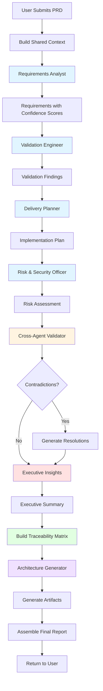
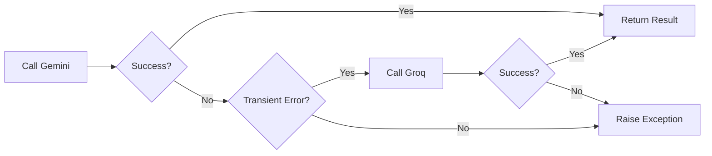

# SentinelIQ Enterprise - Agent Interaction Diagram

## Multi-Agent Pipeline Overview

SentinelIQ Enterprise uses a 5-agent sequential pipeline to analyze Product Requirement Documents (PRDs). Each agent has a specific role and builds upon the outputs of previous agents.

## Agent Interaction Flow



## Detailed Agent Descriptions

### 1. Requirements Analyst

**Purpose**: Extract concrete requirements from the PRD with confidence scoring

**Input**:
- Project specification
- Engineering compliance benchmarks
- Shared context

**Output**:
- Structured requirements
- Confidence scores (0-100%)
- Evidence from spec
- Severity classification
- Business impact assessment

**Format**:
```markdown
**[REQ-001]** Requirement text
- Confidence: X%
- Reason: [explanation]
- Evidence: [quote from spec]
- Severity: [Critical/High/Medium/Low/Informational]
- Business Impact: [explanation]
```

**Key Responsibilities**:
- Identify functional requirements
- Identify non-functional requirements
- Extract constraints and assumptions
- Define success criteria
- Assess requirement clarity

---

### 2. Validation Engineer

**Purpose**: Validate the PRD for gaps, contradictions, and missing details

**Input**:
- Previous agent outputs
- Project specification
- Compliance benchmarks

**Output**:
- Validation checklist
- Gap analysis
- Contradiction detection
- Risky area identification
- Links to requirements

**Format**:
```markdown
**[VAL-001]** Validation finding
- Confidence: X%
- Reason: [explanation]
- Evidence: [quote from spec/requirements]
- Severity: [level]
- Business Impact: [explanation]
- Linked Requirement: [REQ-XXX]
```

**Key Responsibilities**:
- Validate requirement completeness
- Detect internal contradictions
- Identify missing information
- Assess technical feasibility
- Validate against compliance benchmarks

---

### 3. Delivery Planner

**Purpose**: Create actionable implementation plans with milestones

**Input**:
- All previous agent outputs
- Requirements
- Validation findings

**Output**:
- Implementation roadmap
- Architecture suggestions
- Component boundaries
- Sequencing recommendations
- Resource estimates

**Format**:
```markdown
**[PLAN-001]** Planning item
- Confidence: X%
- Reason: [explanation]
- Evidence: [quote from requirements]
- Severity: [level]
- Business Impact: [explanation]
- Linked Requirement: [REQ-XXX]
```

**Key Responsibilities**:
- Define implementation phases
- Suggest architecture patterns
- Identify dependencies
- Estimate timelines
- Recommend technology choices

---

### 4. Risk & Security Officer

**Purpose**: Identify security, privacy, compliance, and operational risks

**Input**:
- All previous agent outputs
- Requirements
- Implementation plan

**Output**:
- Security risk assessment
- Privacy concerns
- Compliance issues
- Operational risks
- Mitigation strategies

**Format**:
```markdown
**[RISK-001]** Risk description
- Confidence: X%
- Reason: [explanation]
- Evidence: [quote from spec/requirements]
- Severity: [level]
- Business Impact: [explanation]
- Linked Requirement: [REQ-XXX]
- Mitigation: [actionable mitigation]
```

**Key Responsibilities**:
- Identify security vulnerabilities
- Assess privacy implications
- Evaluate compliance requirements
- Identify operational risks
- Provide mitigation strategies

---

### 5. Executive Insights Synthesizer

**Purpose**: Synthesize all findings into an executive-ready audit report

**Input**:
- All previous agent outputs
- Cross-agent contradictions (if any)
- Traceability matrix
- Architecture artifacts

**Output**:
- Executive summary
- Project health scores
- Overall readiness percentage
- GO/GO WITH CONDITIONS/BLOCKED decision
- Actionable recommendations

**Format**:
```markdown
## Executive Summary
[High-level overview]

## Score Breakdown
- Security Score: X/100 - [reason]
- Architecture Score: X/100 - [reason]
- Requirements Score: X/100 - [reason]
- Compliance Score: X/100 - [reason]
- Risk Score: X/100 - [reason]

## Overall Readiness
- Percentage: X%
- Decision: [GO/GO WITH CONDITIONS/BLOCKED]
- Reasoning: [explanation]

## Critical Findings
[Severity-based summary]

## Cross-Agent Contradictions Resolved
[Resolution summary]

## Requirement Traceability Summary
[Traceability overview]

## Actionable Recommendations
[Prioritized recommendations]
```

**Key Responsibilities**:
- Aggregate confidence scores
- Calculate health metrics
- Make go/no-go decision
- Resolve contradictions
- Provide executive summary
- Prioritize recommendations

---

## Cross-Agent Validation

### Validation Timing

Cross-agent validation occurs **before** the Executive Insights agent runs. This allows the Executive Insights agent to:

1. Review detected contradictions
2. Understand resolution suggestions
3. Make informed decisions
4. Provide clear explanations in the final report

### Contradiction Detection

The validator uses pattern matching and semantic analysis to detect:

1. **Direct Contradictions**: "must" vs "must not"
2. **Inconsistencies**: "required" vs "optional"
3. **Gaps**: Missing information between phases

### Resolution Strategy

When contradictions are detected:

1. **Identify**: Which phases contradict
2. **Analyze**: The nature of the contradiction
3. **Resolve**: Provide resolution suggestions
4. **Prioritize**: Later phases take precedence (more context)

---

## Traceability Chain

### Requirement Traceability

Every recommendation traces back through the chain:

```
Requirement [REQ-001]
    ↓
Validation Finding [VAL-001]
    ↓
Risk Finding [RISK-001]
    ↓
Recommendation [PLAN-001]
```

### Implementation

1. **Requirements Phase**: Generates [REQ-XXX] IDs
2. **Validation Phase**: Links findings to [REQ-XXX]
3. **Risk Phase**: Links risks to [REQ-XXX]
4. **Planning Phase**: Links recommendations to [REQ-XXX]
5. **Traceability Manager**: Builds matrix from all links

### Benefits

- **Auditability**: Track decision lineage
- **Impact Analysis**: Understand requirement changes
- **Compliance**: Demonstrate due diligence
- **Communication**: Clear rationale for decisions

---

## Architecture Artifact Generation

### Timing

Architecture artifacts are generated **after** all agents complete but **before** report assembly.

### Artifacts Generated

1. **Mermaid Architecture Diagram**: System architecture visualization
2. **Component Diagram**: Detailed component relationships
3. **Data Flow Diagram**: Data movement through system
4. **API Inventory**: All required API endpoints
5. **Database Entities**: Suggested database schema
6. **Deployment Architecture**: Production deployment recommendations

### Integration

Artifacts are embedded in the final report as:
- Mermaid diagrams (rendered in markdown)
- Structured tables (API inventory, database entities)
- Text documentation (deployment architecture)

---

## LLM Failover Strategy

### Primary LLM

**Gemini 2.5 Flash** is the primary LLM for all agents.

### Failover Conditions

Failover to **Groq (Llama 3.3 70B)** occurs on:

1. **429 Rate Limit**: Resource exhausted
2. **503 Service Unavailable**: LLM service down
3. **Timeout**: Request exceeds time limit

### Failover Process



### Transparency

The report includes:
- Which model was used for each phase
- Failover events (if any)
- Model provenance table

---

## Agent Communication Protocol

### Context Passing

Each agent receives:

1. **Shared Context**: Project spec + compliance benchmarks
2. **Previous Outputs**: All prior agent outputs
3. **Phase History**: Which model used for each phase

### Output Format

All agents output:
- Structured markdown
- ID references for traceability
- Confidence scores
- Severity classifications
- Evidence citations

### State Management

- **No persistent state** between requests
- **Session-scoped** state during audit execution
- **Database storage** of final results only

---

## Performance Characteristics

### Execution Time

- **Per Agent**: 5-10 seconds (LLM latency)
- **Total Pipeline**: 30-50 seconds (5 agents)
- **Validation**: <1 second
- **Artifact Generation**: <5 seconds
- **Report Assembly**: <1 second
- **Total**: ~35-60 seconds

### Parallelization Potential

Currently sequential, but could be parallelized:

- **Requirements** and **Validation** could run in parallel
- **Planning** and **Risk** could run in parallel
- **Executive Insights** must wait for all others

Estimated 40% reduction with parallelization.

---

## Error Handling

### Agent-Level Errors

1. **LLM API Failure**: Automatic failover
2. **Timeout**: Retry with exponential backoff
3. **Invalid Output**: Fallback to template
4. **Rate Limit**: Queue and retry

### Pipeline-Level Errors

1. **Agent Failure**: Skip agent, use template
2. **Validation Failure**: Continue without validation
3. **Artifact Generation**: Continue without artifacts
4. **Report Assembly**: Return partial report

### User Communication

All errors are:
- Logged with context
- Translated to user-friendly messages
- Included in report (if applicable)
- Returned via API error response

---

## Future Enhancements

### Planned Agent Improvements

1. **Specialized Agents**: Domain-specific agents (e.g., Compliance Specialist)
2. **Parallel Execution**: Run independent agents concurrently
3. **Interactive Agents**: User can provide feedback during pipeline
4. **Learning Agents**: Improve from past audits

### Enhanced Validation

1. **Semantic Analysis**: NLP-based contradiction detection
2. **Historical Comparison**: Compare with similar projects
3. **Best Practices**: Check against industry standards
4. **Code Analysis**: Analyze existing code if available

### Improved Traceability

1. **Visual Traceability**: Interactive traceability graphs
2. **Impact Simulation**: Show impact of requirement changes
3. **Decision Trees**: Visual decision lineage
4. **Export Options**: Export traceability to various formats
