# SentinelIQ Enterprise - Sequence Diagrams

## Authentication Sequence

### User Signup Flow

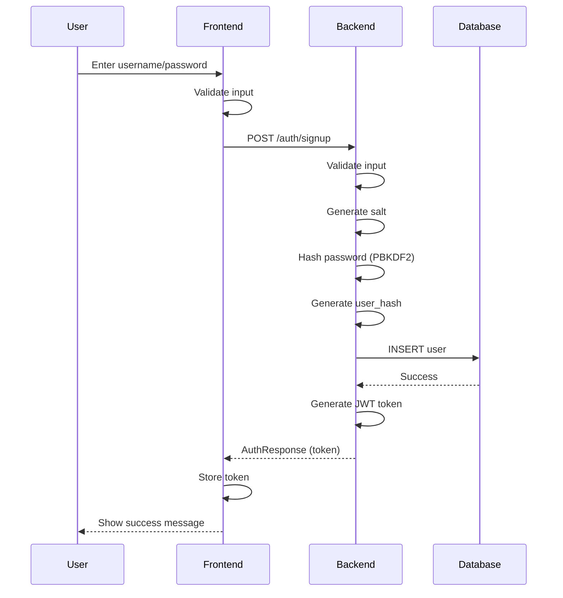
```mermaid
sequenceDiagram
    participant User
    participant Frontend
    participant Backend
    participant Database

    User->>Frontend: Enter username/password
    Frontend->>Frontend: Validate input
    Frontend->>Backend: POST /auth/signup
    Backend->>Backend: Validate input
    Backend->>Backend: Generate salt
    Backend->>Backend: Hash password (PBKDF2)
    Backend->>Backend: Generate user_hash
    Backend->>Database: INSERT user
    Database-->>Backend: Success
    Backend->>Backend: Generate JWT token
    Backend-->>Frontend: AuthResponse (token)
    Frontend->>Frontend: Store token
    Frontend-->>User: Show success message
```

### User Signin Flow

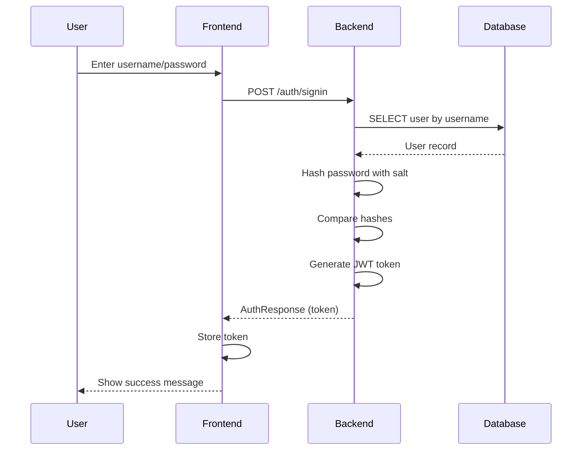
```mermaid
sequenceDiagram
    participant User
    participant Frontend
    participant Backend
    participant Database

    User->>Frontend: Enter username/password
    Frontend->>Backend: POST /auth/signin
    Backend->>Database: SELECT user by username
    Database-->>Backend: User record
    Backend->>Backend: Hash password with salt
    Backend->>Backend: Compare hashes
    Backend->>Backend: Generate JWT token
    Backend-->>Frontend: AuthResponse (token)
    Frontend->>Frontend: Store token
    Frontend-->>User: Show success message
```

### Authenticated Request Flow

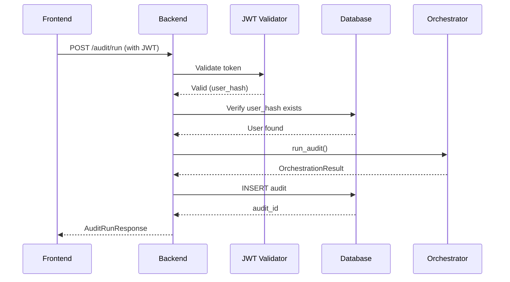
```mermaid
sequenceDiagram
    participant Frontend
    participant Backend
    participant JWT Validator
    participant Database
    participant Orchestrator

    Frontend->>Backend: POST /audit/run (with JWT)
    Backend->>JWT Validator: Validate token
    JWT Validator-->>Backend: Valid (user_hash)
    Backend->>Database: Verify user_hash exists
    Database-->>Backend: User found
    Backend->>Orchestrator: run_audit()
    Orchestrator-->>Backend: OrchestrationResult
    Backend->>Database: INSERT audit
    Database-->>Backend: audit_id
    Backend-->>Frontend: AuditRunResponse
```

---

## Audit Execution Sequence

### Full Audit Pipeline

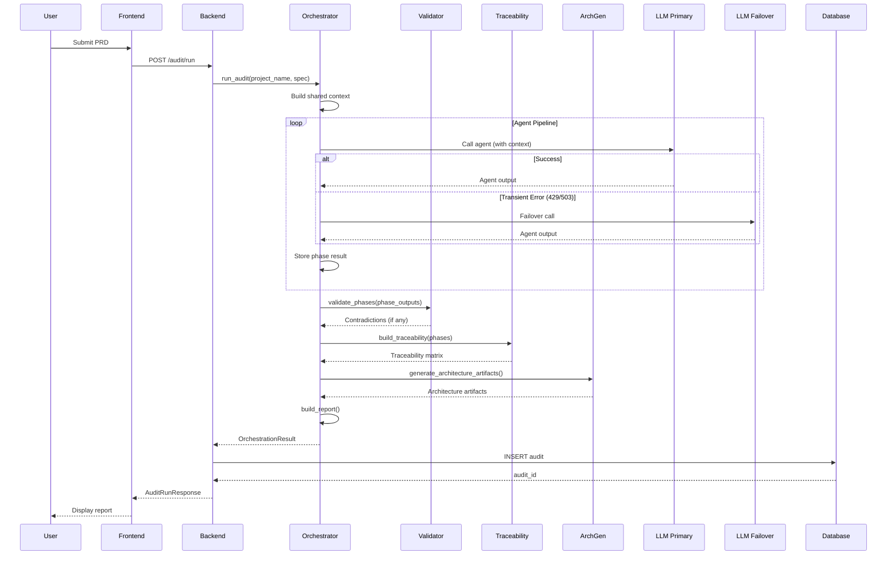
```mermaid
sequenceDiagram
    participant User
    participant Frontend
    participant Backend
    participant Orchestrator
    participant Validator
    participant Traceability
    participant ArchGen
    participant LLM Primary
    participant LLM Failover
    participant Database

    User->>Frontend: Submit PRD
    Frontend->>Backend: POST /audit/run
    Backend->>Orchestrator: run_audit(project_name, spec)
    
    Orchestrator->>Orchestrator: Build shared context
    
    loop Agent Pipeline
        Orchestrator->>LLM Primary: Call agent (with context)
        alt Success
            LLM Primary-->>Orchestrator: Agent output
        else Transient Error (429/503)
            Orchestrator->>LLM Failover: Failover call
            LLM Failover-->>Orchestrator: Agent output
        end
        Orchestrator->>Orchestrator: Store phase result
    end
    
    Orchestrator->>Validator: validate_phases(phase_outputs)
    Validator-->>Orchestrator: Contradictions (if any)
    
    Orchestrator->>Traceability: build_traceability(phases)
    Traceability-->>Orchestrator: Traceability matrix
    
    Orchestrator->>ArchGen: generate_architecture_artifacts()
    ArchGen-->>Orchestrator: Architecture artifacts
    
    Orchestrator->>Orchestrator: build_report()
    Orchestrator-->>Backend: OrchestrationResult
    
    Backend->>Database: INSERT audit
    Database-->>Backend: audit_id
    Backend-->>Frontend: AuditRunResponse
    Frontend-->>User: Display report
```

### Individual Agent Execution

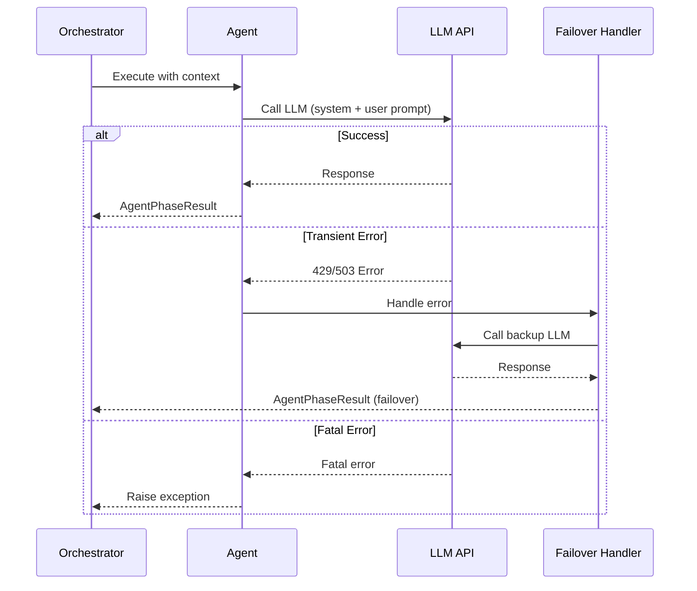
```mermaid
sequenceDiagram
    participant Orchestrator
    participant Agent
    participant LLM API
    participant Failover Handler

    Orchestrator->>Agent: Execute with context
    Agent->>LLM API: Call LLM (system + user prompt)
    
    alt Success
        LLM API-->>Agent: Response
        Agent-->>Orchestrator: AgentPhaseResult
    else Transient Error
        LLM API-->>Agent: 429/503 Error
        Agent->>Failover Handler: Handle error
        Failover Handler->>LLM API: Call backup LLM
        LLM API-->>Failover Handler: Response
        Failover Handler-->>Orchestrator: AgentPhaseResult (failover)
    else Fatal Error
        LLM API-->>Agent: Fatal error
        Agent-->>Orchestrator: Raise exception
    end
```

---

## Cross-Agent Validation Sequence

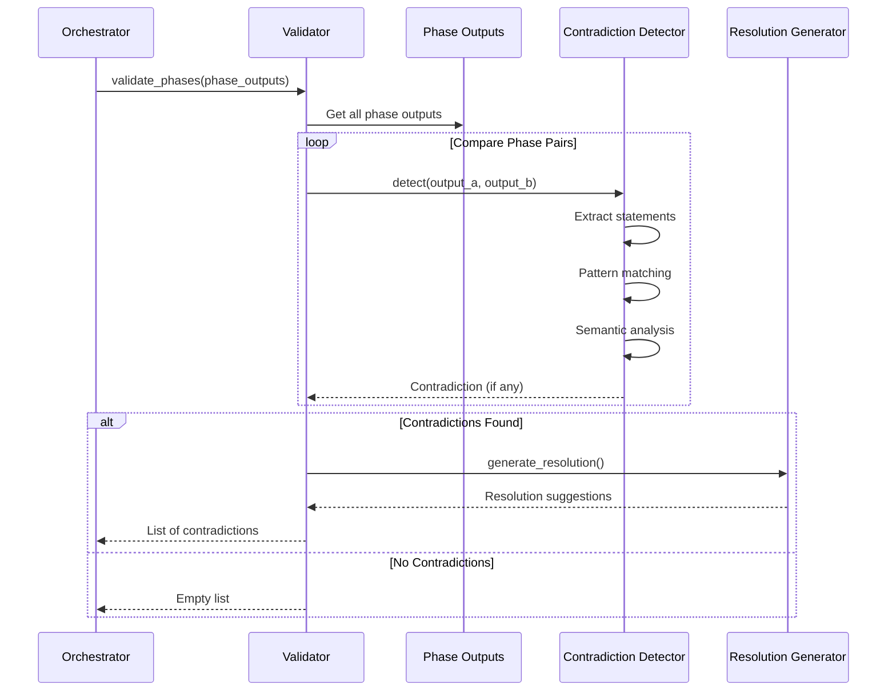
```mermaid
sequenceDiagram
    participant Orchestrator
    participant Validator
    participant Phase Outputs
    participant Contradiction Detector
    participant Resolution Generator

    Orchestrator->>Validator: validate_phases(phase_outputs)
    Validator->>Phase Outputs: Get all phase outputs
    
    loop Compare Phase Pairs
        Validator->>Contradiction Detector: detect(output_a, output_b)
        Contradiction Detector->>Contradiction Detector: Extract statements
        Contradiction Detector->>Contradiction Detector: Pattern matching
        Contradiction Detector->>Contradiction Detector: Semantic analysis
        Contradiction Detector-->>Validator: Contradiction (if any)
    end
    
    alt Contradictions Found
        Validator->>Resolution Generator: generate_resolution()
        Resolution Generator-->>Validator: Resolution suggestions
        Validator-->>Orchestrator: List of contradictions
    else No Contradictions
        Validator-->>Orchestrator: Empty list
    end
```

---

## Traceability Building Sequence

```mermaid
sequenceDiagram
    participant Orchestrator
    participant Traceability Manager
    participant Phase Outputs
    participant Regex Parser
    participant Link Builder

    Orchestrator->>Traceability Manager: build_traceability(phases)
    Traceability Manager->>Phase Outputs: Get requirements output
    
    loop Parse Requirements
        Traceability Manager->>Regex Parser: Extract [REQ-XXX] IDs
        Regex Parser-->>Traceability Manager: Requirement IDs
        Traceability Manager->>Traceability Manager: add_requirement()
    end
    
    loop Parse Validations
        Traceability Manager->>Regex Parser: Extract [VAL-XXX] IDs
        Regex Parser-->>Traceability Manager: Validation IDs
        Traceability Manager->>Link Builder: Find linked requirement
        Link Builder-->>Traceability Manager: Requirement ID
        Traceability Manager->>Traceability Manager: link_validation()
    end
    
    loop Parse Risks
        Traceability Manager->>Regex Parser: Extract [RISK-XXX] IDs
        Regex Parser-->>Traceability Manager: Risk IDs
        Traceability Manager->>Link Builder: Find linked requirement
        Link Builder-->>Traceability Manager: Requirement ID
        Traceability Manager->>Traceability Manager: link_risk()
    end
    
    loop Parse Planning
        Traceability Manager->>Regex Parser: Extract [PLAN-XXX] IDs
        Regex Parser-->>Traceability Manager: Planning IDs
        Traceability Manager->>Link Builder: Find linked requirement
        Link Builder-->>Traceability Manager: Requirement ID
        Traceability Manager->>Traceability Manager: link_recommendation()
    end
    
    Traceability Manager-->>Orchestrator: Traceability complete
```

---

## Architecture Artifact Generation Sequence

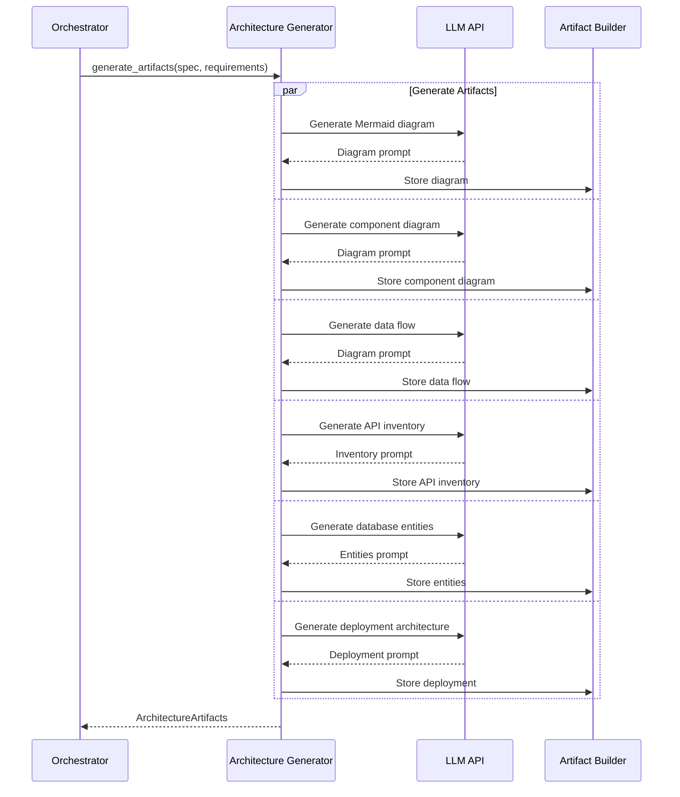
```mermaid
sequenceDiagram
    participant Orchestrator
    participant Architecture Generator
    participant LLM API
    participant Artifact Builder

    Orchestrator->>Architecture Generator: generate_artifacts(spec, requirements)
    
    par Generate Artifacts
        Architecture Generator->>LLM API: Generate Mermaid diagram
        LLM API-->>Architecture Generator: Diagram prompt
        Architecture Generator->>Artifact Builder: Store diagram
    and
        Architecture Generator->>LLM API: Generate component diagram
        LLM API-->>Architecture Generator: Diagram prompt
        Architecture Generator->>Artifact Builder: Store component diagram
    and
        Architecture Generator->>LLM API: Generate data flow
        LLM API-->>Architecture Generator: Diagram prompt
        Architecture Generator->>Artifact Builder: Store data flow
    and
        Architecture Generator->>LLM API: Generate API inventory
        LLM API-->>Architecture Generator: Inventory prompt
        Architecture Generator->>Artifact Builder: Store API inventory
    and
        Architecture Generator->>LLM API: Generate database entities
        LLM API-->>Architecture Generator: Entities prompt
        Architecture Generator->>Artifact Builder: Store entities
    and
        Architecture Generator->>LLM API: Generate deployment architecture
        LLM API-->>Architecture Generator: Deployment prompt
        Architecture Generator->>Artifact Builder: Store deployment
    end
    
    Architecture Generator-->>Orchestrator: ArchitectureArtifacts
```

---

## Report Assembly Sequence

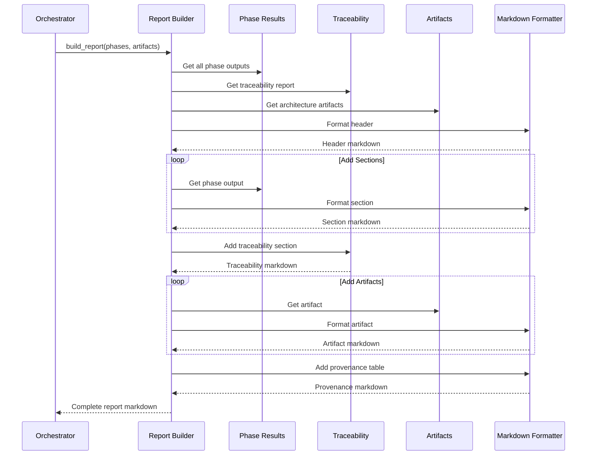
```mermaid
sequenceDiagram
    participant Orchestrator
    participant Report Builder
    participant Phase Results
    participant Traceability
    participant Artifacts
    participant Markdown Formatter

    Orchestrator->>Report Builder: build_report(phases, artifacts)
    Report Builder->>Phase Results: Get all phase outputs
    Report Builder->>Traceability: Get traceability report
    Report Builder->>Artifacts: Get architecture artifacts
    
    Report Builder->>Markdown Formatter: Format header
    Markdown Formatter-->>Report Builder: Header markdown
    
    loop Add Sections
        Report Builder->>Phase Results: Get phase output
        Report Builder->>Markdown Formatter: Format section
        Markdown Formatter-->>Report Builder: Section markdown
    end
    
    Report Builder->>Traceability: Add traceability section
    Traceability-->>Report Builder: Traceability markdown
    
    loop Add Artifacts
        Report Builder->>Artifacts: Get artifact
        Report Builder->>Markdown Formatter: Format artifact
        Markdown Formatter-->>Report Builder: Artifact markdown
    end
    
    Report Builder->>Markdown Formatter: Add provenance table
    Markdown Formatter-->>Report Builder: Provenance markdown
    
    Report Builder-->>Orchestrator: Complete report markdown
```

---

## Error Handling Sequence

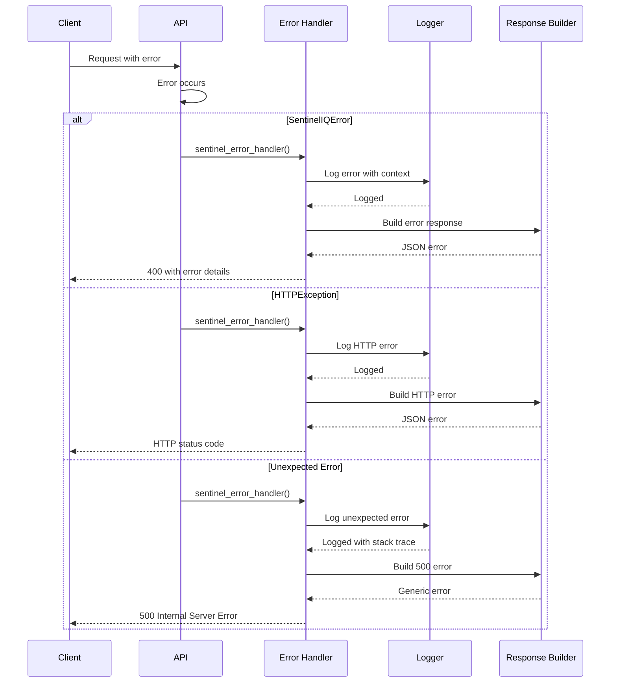
```mermaid
sequenceDiagram
    participant Client
    participant API
    participant Error Handler
    participant Logger
    participant Response Builder

    Client->>API: Request with error
    API->>API: Error occurs
    
    alt SentinelIQError
        API->>Error Handler: sentinel_error_handler()
        Error Handler->>Logger: Log error with context
        Logger-->>Error Handler: Logged
        Error Handler->>Response Builder: Build error response
        Response Builder-->>Error Handler: JSON error
        Error Handler-->>Client: 400 with error details
    else HTTPException
        API->>Error Handler: sentinel_error_handler()
        Error Handler->>Logger: Log HTTP error
        Logger-->>Error Handler: Logged
        Error Handler->>Response Builder: Build HTTP error
        Response Builder-->>Error Handler: JSON error
        Error Handler-->>Client: HTTP status code
    else Unexpected Error
        API->>Error Handler: sentinel_error_handler()
        Error Handler->>Logger: Log unexpected error
        Logger-->>Error Handler: Logged with stack trace
        Error Handler->>Response Builder: Build 500 error
        Response Builder-->>Error Handler: Generic error
        Error Handler-->>Client: 500 Internal Server Error
    end
```

---

## Rate Limiting Sequence

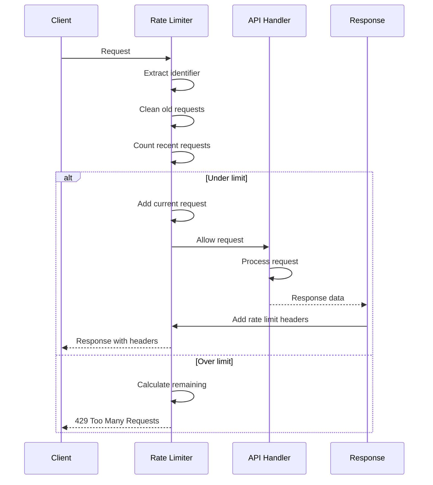
```mermaid
sequenceDiagram
    participant Client
    participant Rate Limiter
    participant API Handler
    participant Response

    Client->>Rate Limiter: Request
    Rate Limiter->>Rate Limiter: Extract identifier
    Rate Limiter->>Rate Limiter: Clean old requests
    Rate Limiter->>Rate Limiter: Count recent requests
    
    alt Under limit
        Rate Limiter->>Rate Limiter: Add current request
        Rate Limiter->>API Handler: Allow request
        API Handler->>API Handler: Process request
        API Handler-->>Response: Response data
        Response->>Rate Limiter: Add rate limit headers
        Rate Limiter-->>Client: Response with headers
    else Over limit
        Rate Limiter->>Rate Limiter: Calculate remaining
        Rate Limiter-->>Client: 429 Too Many Requests
    end
```

---

## Database Migration Sequence

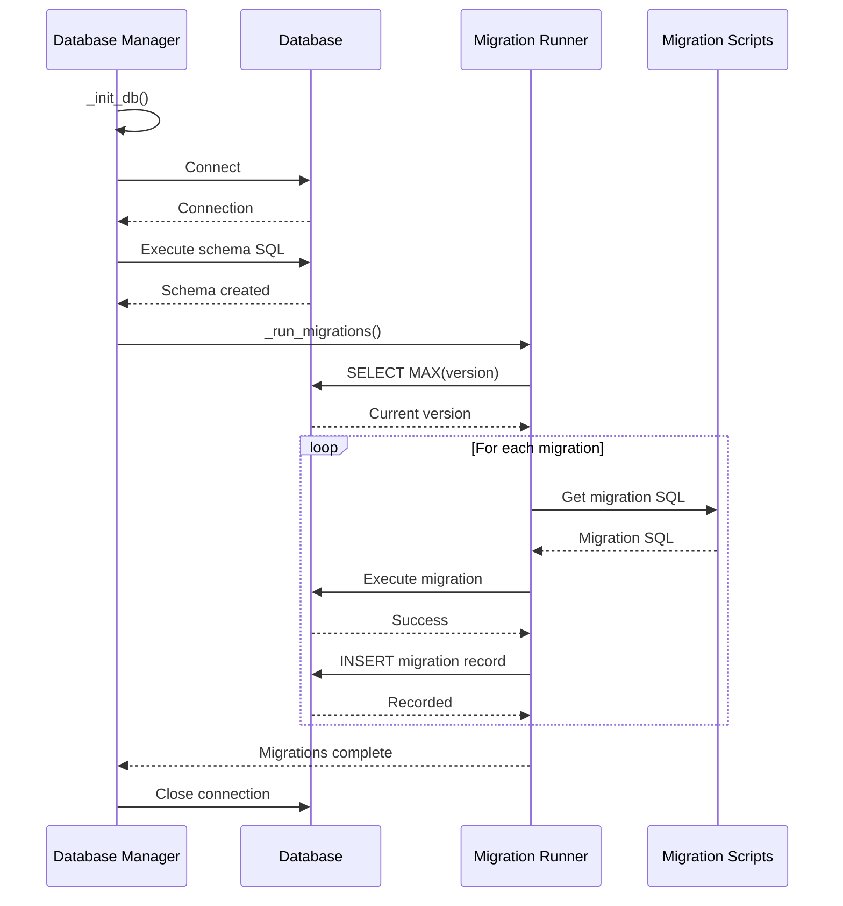
```mermaid
sequenceDiagram
    participant Database Manager
    participant Database
    participant Migration Runner
    participant Migration Scripts

    Database Manager->>Database Manager: _init_db()
    Database Manager->>Database: Connect
    Database-->>Database Manager: Connection
    Database Manager->>Database: Execute schema SQL
    Database-->>Database Manager: Schema created
    
    Database Manager->>Migration Runner: _run_migrations()
    Migration Runner->>Database: SELECT MAX(version)
    Database-->>Migration Runner: Current version
    
    loop For each migration
        Migration Runner->>Migration Scripts: Get migration SQL
        Migration Scripts-->>Migration Runner: Migration SQL
        Migration Runner->>Database: Execute migration
        Database-->>Migration Runner: Success
        Migration Runner->>Database: INSERT migration record
        Database-->>Migration Runner: Recorded
    end
    
    Migration Runner-->>Database Manager: Migrations complete
    Database Manager->>Database: Close connection
```

---

## Health Check Sequence

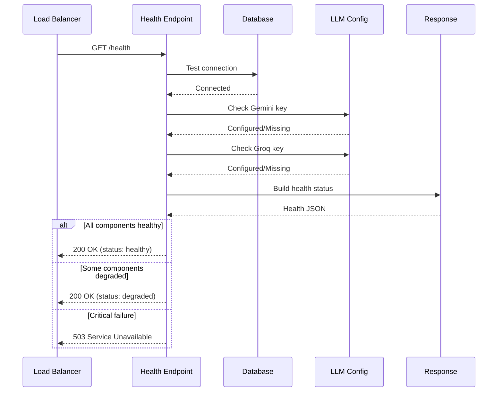
```mermaid
sequenceDiagram
    participant Load Balancer
    participant Health Endpoint
    participant Database
    participant LLM Config
    participant Response

    Load Balancer->>Health Endpoint: GET /health
    Health Endpoint->>Database: Test connection
    Database-->>Health Endpoint: Connected
    
    Health Endpoint->>LLM Config: Check Gemini key
    LLM Config-->>Health Endpoint: Configured/Missing
    
    Health Endpoint->>LLM Config: Check Groq key
    LLM Config-->>Health Endpoint: Configured/Missing
    
    Health Endpoint->>Response: Build health status
    Response-->>Health Endpoint: Health JSON
    
    alt All components healthy
        Health Endpoint-->>Load Balancer: 200 OK (status: healthy)
    else Some components degraded
        Health Endpoint-->>Load Balancer: 200 OK (status: degraded)
    else Critical failure
        Health Endpoint-->>Load Balancer: 503 Service Unavailable
    end
```

---

## Frontend Audit Execution Sequence

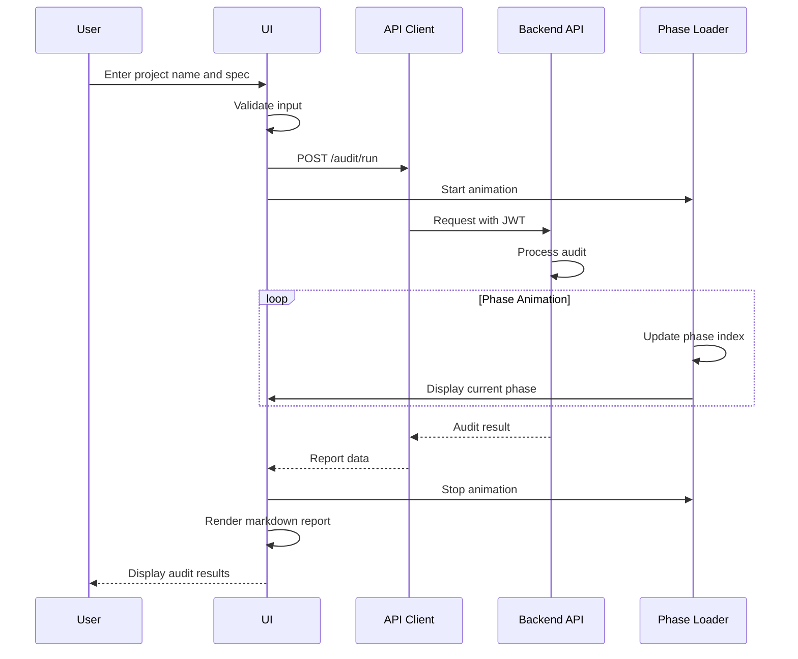
```mermaid
sequenceDiagram
    participant User
    participant UI
    participant API Client
    participant Backend API
    participant Phase Loader

    User->>UI: Enter project name and spec
    UI->>UI: Validate input
    UI->>API Client: POST /audit/run
    UI->>Phase Loader: Start animation
    
    API Client->>Backend API: Request with JWT
    Backend API->>Backend API: Process audit
    
    loop Phase Animation
        Phase Loader->>Phase Loader: Update phase index
        Phase Loader->>UI: Display current phase
    end
    
    Backend API-->>API Client: Audit result
    API Client-->>UI: Report data
    UI->>Phase Loader: Stop animation
    UI->>UI: Render markdown report
    UI-->>User: Display audit results
```

---

## Audit History Retrieval Sequence

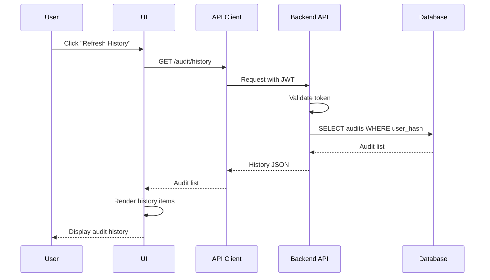
```mermaid
sequenceDiagram
    participant User
    participant UI
    participant API Client
    participant Backend API
    participant Database

    User->>UI: Click "Refresh History"
    UI->>API Client: GET /audit/history
    API Client->>Backend API: Request with JWT
    Backend API->>Backend API: Validate token
    Backend API->>Database: SELECT audits WHERE user_hash
    Database-->>Backend API: Audit list
    Backend API-->>API Client: History JSON
    API Client-->>UI: Audit list
    UI->>UI: Render history items
    UI-->>User: Display audit history
```

---

## Audit Detail Retrieval Sequence

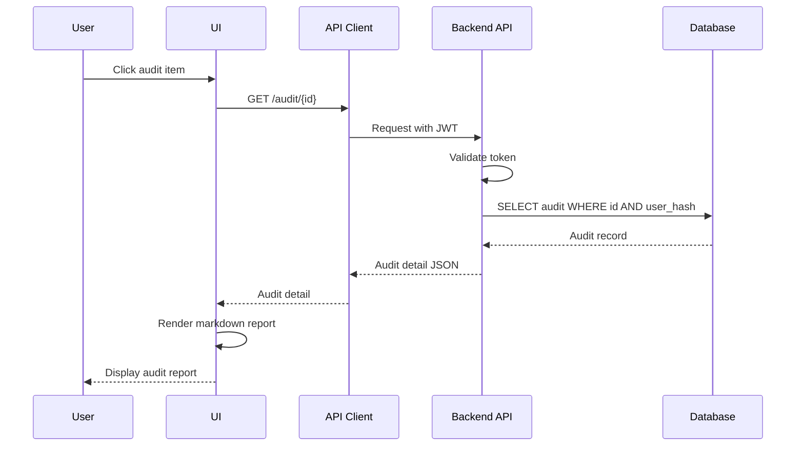
```mermaid
sequenceDiagram
    participant User
    participant UI
    participant API Client
    participant Backend API
    participant Database

    User->>UI: Click audit item
    UI->>API Client: GET /audit/{id}
    API Client->>Backend API: Request with JWT
    Backend API->>Backend API: Validate token
    Backend API->>Database: SELECT audit WHERE id AND user_hash
    Database-->>Backend API: Audit record
    Backend API-->>API Client: Audit detail JSON
    API Client-->>UI: Audit detail
    UI->>UI: Render markdown report
    UI-->>User: Display audit report
```

---

## Report Download Sequence

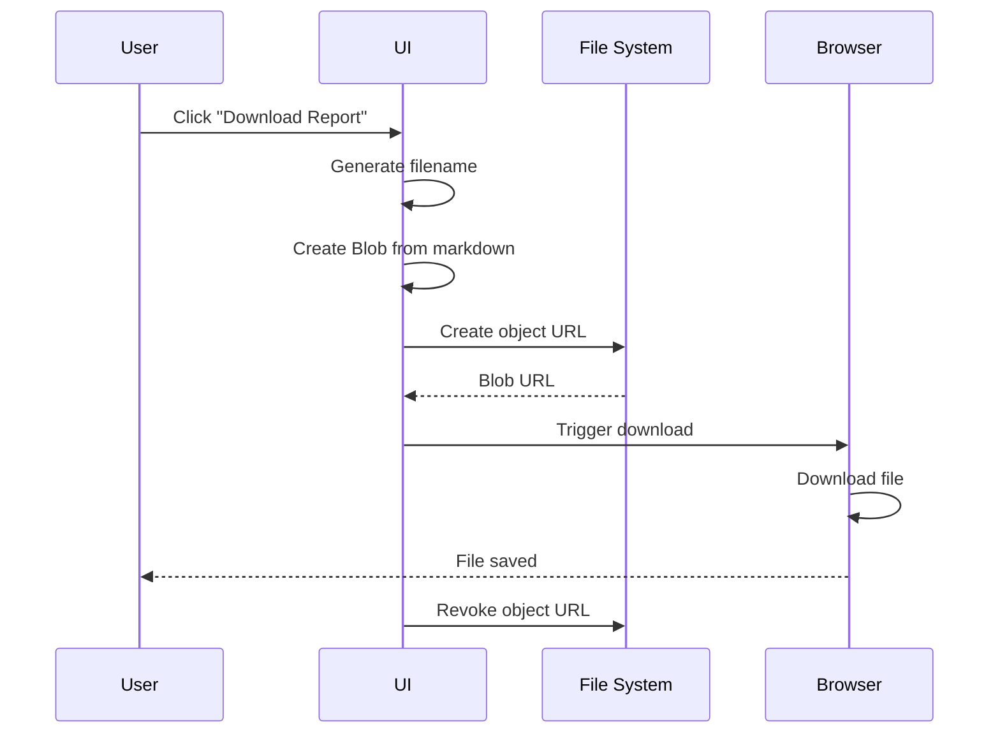
```mermaid
sequenceDiagram
    participant User
    participant UI
    participant File System
    participant Browser

    User->>UI: Click "Download Report"
    UI->>UI: Generate filename
    UI->>UI: Create Blob from markdown
    UI->>File System: Create object URL
    File System-->>UI: Blob URL
    UI->>Browser: Trigger download
    Browser->>Browser: Download file
    Browser-->>User: File saved
    UI->>File System: Revoke object URL
```
