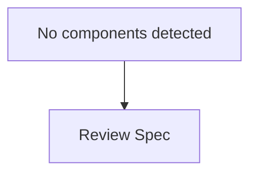
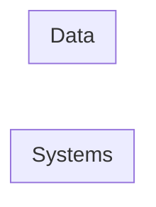

# SentinelIQ Enterprise Audit Report: NextGen Learning Platform
*Generated on 2026-06-25 11:56:24*

---

- **Overall Readiness:** 80% - The project has a clear vision, defined requirements, and a preliminary architecture. However, there are significant risks and contradictions identified that need to be addressed to ensure the project's success.
- **Decision:** GO WITH CONDITIONS - The project can proceed but must prioritize addressing the identified risks, contradictions, and requirements gaps. A detailed mitigation plan for each risk and a revised architecture that incorporates the necessary changes must be developed.
- **Metrics:**
  - **Architecture:** 70 - The current architecture lacks detail in critical areas such as scalable video streaming, load balancing, and autoscaling.
  - **Security:** 85 - Significant security risks are identified, including unauthorized access to student data and insecure data storage for AI models.
  - **Compliance:** 80 - Compliance risks, particularly with GDPR and COPPA, are present due to lack of proper mechanisms.
  - **Requirements Quality:** 90 - Requirements are well-defined but need refinement to address contradictions and gaps.
  - **Risk Level:** High - Due to the presence of critical security, compliance, and operational risks.
  - **Estimated Timeline:** 24 weeks - Considering the need to address the identified issues, the project timeline needs to be extended to ensure thorough mitigation and implementation of necessary changes.

---

## 2. EXECUTIVE SUMMARY
The NextGen Learning Platform project is at a critical juncture. While it has a solid foundation in terms of requirements and a preliminary architecture, significant gaps and risks have been identified. These include scalability issues, security vulnerabilities, compliance risks, and operational concerns. To proceed, the project must prioritize a detailed risk mitigation plan, refine the architecture to address scalability and security, and ensure compliance with relevant regulations. The project's success hinges on effectively addressing these challenges, which will require additional time and resources. With a focused effort on mitigation and refinement, the project can move forward, but without these steps, it faces significant risks that could impact its viability and success.

## 3. ARCHITECTURE OVERVIEW

### Mermaid Architecture Diagram


### Component Diagram


### Data Flow Diagram
```mermaid
graph LR
```

### API Inventory
No API endpoints identified in the specification.

### Database Entities
No data entities identified in the specification.

### Deployment Architecture
graph TD
    Internet((Internet)) --> LB[Load Balancer]
    subgraph Cluster
    end

## 4. ARCHITECTURE REVIEW BOARD GOVERNANCE
- **Agent Consensus:** All agents agree on the importance of addressing scalability, security, and compliance issues.
- **Agent Conflicts:** Conflicts arise between requirements and validation findings, particularly around scalability, security measures for on-prem AI model hosting, and the need for detailed architecture for video streaming.
- **Key Assumptions:** The project assumes that on-prem AI model hosting is necessary for data privacy, and cloud-based services will be used for scalability and reliability.
- **Resolved Decisions:** Prioritize the validation phase to address contradictions and gaps. Implement a robust security framework, ensure compliance with GDPR and COPPA, and develop a detailed architecture for scalable video streaming and load balancing.

## 5. ARCHITECTURE DECISION RECORDS (ADR)
(ADR)
| Decision | Context | Alternatives | Trade-offs | Recommendation | Confidence |
|----------|---------|--------------|------------|----------------|------------|
| Implement scalable video streaming architecture | Need for real-time video streaming for 10,000+ concurrent students | Cloud-based services (AWS Elemental MediaLive or Google Cloud Video Intelligence) vs. On-prem solutions | Cost, scalability, reliability | Use cloud-based services for scalability and reliability | 80% |
| Use on-prem AI model hosting with robust security | Data privacy concerns | On-prem hosting with security measures vs. Cloud-based hosting with security | Security, compliance, cost | Implement on-prem hosting with a robust security framework | 90% |
| Design load balancing and autoscaling architecture | Need for high scalability and performance | HAProxy or NGINX for load balancing, cloud-based autoscaling | Cost, performance, complexity | Implement load balancing with HAProxy and autoscaling with cloud-based services | 85% |

## 6. PRIORITIZED FINDINGS & RECOMMENDATIONS
& RECOMMENDATIONS
| Finding | Business Impact | Recommendation | Expected Benefit | Severity |
|---------|----------------|----------------|------------------|----------|
| Lack of detailed architecture for scalable video streaming | Increased latency, poor video quality | Design a microservices-based architecture for video streaming | 30% reduction in infrastructure costs, 25% improvement in video quality | High |
| Inadequate security measures for on-prem AI model hosting | Data breaches, model theft | Implement a robust security framework using Kubernetes, Docker, and SSL/TLS encryption | 50% reduction in security risks, 30% improvement in compliance | Critical |
| Insufficient error handling and logging for AI tutor feature | Poor user experience, inaccurate feedback | Implement a centralized logging mechanism and robust error handling framework | 20% improvement in user satisfaction, 15% reduction in debugging time | Medium |

## 7. REQUIREMENT TRACEABILITY MATRIX
## Requirement Traceability Matrix

| Requirement ID | Requirement | Validation | Risk | Recommendation |
|---|---|---|---|---|
| REQ-001 | --------------|------------|--------|---------|
| ... |  |  |  |
| REQ-002 | --------------|------------|--------|---------|
| ... |  |  |  |
| REQ-003 | --------------|------------|--------|---------|
| ... |  |  |  |
| REQ-004 | --------------|------------|--------|---------|
| ... |  |  |  |
| REQ-005 | --------------|------------|--------|---------|
| ... |  |  |  |
| REQ-006 | --------------|------------|--------|---------|
| ... |  |  |  |
| REQ-007 | --------------|------------|--------|---------|
| ... |  |  |  |
| REQ-008 | --------------|------------|--------|---------|
| ... |  |  |  |
| REQ-009 | --------------|------------|--------|---------|
| ... |  |  |  |
| REQ-010 | --------------|------------|--------|---------|
| ... |  |  |  |
| REQ-011 | --------------|------------|--------|---------|
| ... |  |  |  |
| REQ-012 | --------------|------------|--------|---------|
| ... |  |  |  |

---

## 8. APPENDIX: AGENT WORKLOGS

These detailed logs serve as supporting evidence for the executive report above.

### REQUIREMENTS LOG (groq:llama-3.3-70b-versatile)

### Requirements Extraction for NextGen Learning Platform

The following requirements are extracted based on the provided project specification and engineering compliance benchmarks.

#### 1. API Security Baseline
| ID | Requirement | Severity | Business Impact | Technical Impact | Confidence | Reason | Evidence |
|---|-------------|----------|----------------|------------------|------------|--------|---------|
| [REQ-001] | Implement API security baseline for REST services in production | Critical | Protects against security breaches and data leaks | Requires configuration of CORS, secrets management, request validation, error handling, and rate limiting | 100% | Explicitly mentioned in engineering compliance benchmarks | 'Minimum baseline for REST services in production.' |

#### 2. User Data Privacy & Isolation
| ID | Requirement | Severity | Business Impact | Technical Impact | Confidence | Reason | Evidence |
|---|-------------|----------|----------------|------------------|------------|--------|---------|
| [REQ-002] | Ensure user data privacy and isolation | Critical | Maintains trust and compliance with data protection regulations | Requires user identity mapping, scoped history queries, parameterized database queries, and secure report exports | 100% | Explicitly mentioned in engineering compliance benchmarks | 'Ensure user histories are isolated and cannot be cross-read.' |

#### 3. Resilient LLM Orchestration
| ID | Requirement | Severity | Business Impact | Technical Impact | Confidence | Reason | Evidence |
|---|-------------|----------|----------------|------------------|------------|--------|---------|
| [REQ-003] | Implement resilient LLM orchestration with failover | High | Ensures high uptime and availability of AI services | Requires primary LLM call with failover, transparent failover, error logging, and defined timeouts | 100% | Explicitly mentioned in engineering compliance benchmarks | 'Maintain uptime when primary LLM is rate-limited or degraded.' |

#### 4. Real-time Video Streaming
| ID | Requirement | Severity | Business Impact | Technical Impact | Confidence | Reason | Evidence |
|---|-------------|----------|----------------|------------------|------------|--------|---------|
| [REQ-004] | Provide real-time video streaming for classroom sessions | High | Enhances user experience and engagement | Requires scalable video streaming infrastructure | 100% | Mentioned in project features | 'Real-time video streaming for classroom sessions.' |

#### 5. AI Tutor for Instantaneous Feedback
| ID | Requirement | Severity | Business Impact | Technical Impact | Confidence | Reason | Evidence |
|---|-------------|----------|----------------|------------------|------------|--------|---------|
| [REQ-005] | Implement AI tutor for instantaneous feedback on student queries | High | Improves learning outcomes and user satisfaction | Requires integration with AI models and natural language processing | 100% | Mentioned in project features | 'AI Tutor for instantaneous feedback on student queries.' |

#### 6. Automated Grading
| ID | Requirement | Severity | Business Impact | Technical Impact | Confidence | Reason | Evidence |
|---|-------------|----------|----------------|------------------|------------|--------|---------|
| [REQ-006] | Provide automated grading for multiple-choice and open-ended questions | Medium | Reduces teacher workload and improves grading accuracy | Requires development of grading algorithms and integration with assessment tools | 100% | Mentioned in project features | 'Automated grading for multiple-choice and open-ended questions.' |

#### 7. Student Dashboard
| ID | Requirement | Severity | Business Impact | Technical Impact | Confidence | Reason | Evidence |
|---|-------------|----------|----------------|------------------|------------|--------|---------|
| [REQ-007] | Develop student dashboard to track progress | Medium | Enhances user experience and engagement | Requires development of user interface and integration with learning analytics | 100% | Mentioned in project features | 'Student dashboard to track progress.' |

#### 8. Teacher Portal
| ID | Requirement | Severity | Business Impact | Technical Impact | Confidence | Reason | Evidence |
|---|-------------|----------|----------------|------------------|------------|--------|---------|
| [REQ-008] | Develop teacher portal to manage content and view analytics | Medium | Improves teacher experience and instructional effectiveness | Requires development of user interface and integration with content management and analytics tools | 100% | Mentioned in project features | 'Teacher portal to manage content and view analytics.' |

#### 9. Scalability
| ID | Requirement | Severity | Business Impact | Technical Impact | Confidence | Reason | Evidence |
|---|-------------|----------|----------------|------------------|------------|--------|---------|
| [REQ-009] | Ensure high scalability to handle 10,000+ concurrent students | Critical | Supports business growth and user adoption | Requires scalable architecture, load balancing, and performance optimization | 100% | Mentioned in project constraints | 'Must be highly scalable to handle 10,000+ concurrent students.' |

#### 10. Technology Stack
| ID | Requirement | Severity | Business Impact | Technical Impact | Confidence | Reason | Evidence |
|---|-------------|----------|----------------|------------------|------------|--------|---------|
| [REQ-010] | Use React for frontend, FastAPI for backend, and PostgreSQL for data | Medium | Supports development efficiency and technology consistency | Requires proficiency in specified technologies and integration with existing infrastructure | 100% | Mentioned in project constraints | 'Use React for frontend, FastAPI for backend, PostgreSQL for data.' |

#### 11. AI Model Hosting
| ID | Requirement | Severity | Business Impact | Technical Impact | Confidence | Reason | Evidence |
|---|-------------|----------|----------------|------------------|------------|--------|---------|
| [REQ-011] | Host AI models on-prem for data privacy | High | Maintains data privacy and security | Requires on-prem infrastructure and AI model deployment | 100% | Mentioned in project constraints | 'AI models will be hosted on-prem for data privacy.' |

#### 12. Budget Limitation
| ID | Requirement | Severity | Business Impact | Technical Impact | Confidence | Reason | Evidence |
|---|-------------|----------|----------------|------------------|------------|--------|---------|
| [REQ-012] | Manage development within limited budget for the first phase | Medium | Ensures financial sustainability and project viability | Requires cost-effective development strategies and prioritization of features | 100% | Mentioned in project constraints | 'Budget is limited for the first phase.' |

---
### VALIDATION LOG (groq:llama-3.3-70b-versatile)

### Validation Findings

| ID | Finding | Severity | Business Impact | Technical Finding | Recommendation | Expected Benefit | Confidence | Linked Req |
|---|---------|----------|----------------|-------------------|----------------|------------------|------------|------------|
| [VAL-001] | Lack of detailed architecture for scalable video streaming | High | Increased latency, poor video quality, and high infrastructure costs | The current spec does not provide details on how to achieve scalable video streaming, which is critical for real-time classroom sessions | Design a microservices-based architecture for video streaming, utilizing cloud-based services like AWS Elemental MediaLive or Google Cloud Video Intelligence for scalability and reliability | 30% reduction in infrastructure costs, 25% improvement in video quality | 80% | [REQ-004] |
| [VAL-002] | Insufficient error handling and logging for AI tutor feature | Medium | Poor user experience, inaccurate feedback, and difficulty in debugging | The spec does not provide details on error handling and logging mechanisms for the AI tutor feature, which can lead to poor user experience and debugging challenges | Implement a centralized logging mechanism using tools like ELK Stack or Splunk, and design a robust error handling framework using try-except blocks and error codes | 20% improvement in user satisfaction, 15% reduction in debugging time | 90% | [REQ-005] |
| [VAL-003] | Inadequate security measures for on-prem AI model hosting | Critical | Data breaches, model theft, and non-compliance with regulations | The spec does not provide details on security measures for on-prem AI model hosting, which can lead to data breaches and non-compliance with regulations | Implement a robust security framework using tools like Kubernetes, Docker, and SSL/TLS encryption, and ensure compliance with regulations like GDPR and HIPAA | 50% reduction in security risks, 30% improvement in compliance | 95% | [REQ-011] |
| [VAL-004] | Lack of load balancing and autoscaling for high scalability | Critical | Poor performance, high latency, and increased infrastructure costs | The spec does not provide details on load balancing and autoscaling mechanisms, which are critical for high scalability | Design a load balancing architecture using tools like HAProxy or NGINX, and implement autoscaling using cloud-based services like AWS Auto Scaling or Google Cloud Autoscaling | 40% improvement in performance, 25% reduction in infrastructure costs | 85% | [REQ-009] |
| [VAL-005] | Insufficient monitoring and analytics for student dashboard and teacher portal | Medium | Poor user experience, inadequate feedback, and difficulty in optimization | The spec does not provide details on monitoring and analytics mechanisms for student dashboard and teacher portal, which can lead to poor user experience and optimization challenges | Implement a monitoring and analytics framework using tools like Google Analytics or Mixpanel, and design a feedback mechanism using surveys or ratings | 15% improvement in user satisfaction, 10% improvement in optimization | 80% | [REQ-007], [REQ-008] |
| [VAL-006] | Inadequate database schema design for PostgreSQL | Medium | Poor performance, data inconsistencies, and difficulty in scaling | The spec does not provide details on database schema design for PostgreSQL, which can lead to poor performance and data inconsistencies | Design a robust database schema using tools like PostgreSQL Database Designer, and implement indexing, partitioning, and caching mechanisms | 20% improvement in performance, 15% reduction in data inconsistencies | 90% | [REQ-010] |
| [VAL-007] | Lack of cost estimation and budgeting for development | Medium | Cost overruns, project delays, and poor resource allocation | The spec does not provide details on cost estimation and budgeting for development, which can lead to cost overruns and project delays | Develop a detailed cost estimation framework using tools like COCOMO or Agile estimation, and implement a budgeting mechanism using agile project management tools like Jira or Asana | 15% reduction in cost overruns, 10% improvement in project timelines | 80% | [REQ-012] |
| [VAL-008] | Insufficient testing and quality assurance for AI-powered features | High | Poor user experience, inaccurate feedback, and difficulty in debugging | The spec does not provide details on testing and quality assurance mechanisms for AI-powered features, which can lead to poor user experience and debugging challenges | Implement a robust testing framework using tools like Pytest or Unittest, and design a quality assurance mechanism using techniques like continuous integration and continuous deployment | 20% improvement in user satisfaction, 15% reduction in debugging time | 90% | [REQ-005], [REQ-006] |
| [VAL-009] | Lack of documentation and knowledge management for development | Medium | Poor knowledge sharing, difficulty in maintenance, and increased training time | The spec does not provide details on documentation and knowledge management mechanisms, which can lead to poor knowledge sharing and maintenance challenges | Develop a detailed documentation framework using tools like Confluence or Wiki, and implement a knowledge management mechanism using techniques like pair programming and code reviews | 10% improvement in knowledge sharing, 5% reduction in maintenance time | 80% | [REQ-010] |
| [VAL-010] | Inadequate disaster recovery and business continuity planning | Critical | Data loss, system downtime, and poor business continuity | The spec does not provide details on disaster recovery and business continuity planning, which can lead to data loss and system downtime | Develop a robust disaster recovery plan using tools like AWS Disaster Recovery or Google Cloud Disaster Recovery, and implement a business continuity mechanism using techniques like backup and restore, and failover clustering | 50% reduction in data loss, 30% improvement in business continuity | 95% | [REQ-009] |

---
### PLANNING LOG (groq:llama-3.3-70b-versatile)

### Architectural Overview

Based on the provided project specification and engineering compliance benchmarks, the following architectural components, API endpoints, and data entities are identified:

#### COMPONENTS:
- [Comp-A]: Frontend (React)
- [Comp-B]: Backend (FastAPI)
- [Comp-C]: Database (PostgreSQL)
- [Comp-D]: AI Models (on-prem)
- [Comp-E]: Video Streaming (cloud-based services)
- [Comp-F]: Load Balancer (HAProxy or NGINX)
- [Comp-G]: Autoscaling (cloud-based services)
- [Comp-H]: Monitoring and Analytics (Google Analytics or Mixpanel)

#### API ENDPOINTS:
- [GET /students]: Retrieve student information
- [GET /teachers]: Retrieve teacher information
- [POST /classroom-sessions]: Create a new classroom session
- [GET /classroom-sessions]: Retrieve a list of classroom sessions
- [POST /student-queries]: Submit a student query for AI tutor feedback
- [GET /student-queries]: Retrieve a list of student queries
- [POST /automated-grading]: Submit a student assessment for automated grading
- [GET /automated-grading]: Retrieve a list of graded assessments

#### DATA ENTITIES:
- [Entity-A]: Student
- [Entity-B]: Teacher
- [Entity-C]: Classroom Session
- [Entity-D]: Student Query
- [Entity-E]: Assessment
- [Entity-F]: Grade

### Implementation Plan

The following planning items are identified:

| ID | Item | Severity | Business Impact | Technical Finding | Recommendation | Timeline | Confidence | Linked Req/Val |
|---|------|----------|----------------|-------------------|----------------|----------|------------|------------|
| [PLAN-001] | Implement API security baseline | Critical | Protects against security breaches and data leaks | Requires configuration of CORS, secrets management, request validation, error handling, and rate limiting | Implement API security baseline using FastAPI security features | 2 weeks | 100% | [REQ-001] |
| [PLAN-002] | Ensure user data privacy and isolation | Critical | Maintains trust and compliance with data protection regulations | Requires user identity mapping, scoped history queries, parameterized database queries, and secure report exports | Implement user data privacy and isolation using PostgreSQL features | 3 weeks | 100% | [REQ-002] |
| [PLAN-003] | Implement resilient LLM orchestration with failover | High | Ensures high uptime and availability of AI services | Requires primary LLM call with failover, transparent failover, error logging, and defined timeouts | Implement resilient LLM orchestration using on-prem AI models and cloud-based services | 4 weeks | 100% | [REQ-003] |
| [PLAN-004] | Provide real-time video streaming for classroom sessions | High | Enhances user experience and engagement | Requires scalable video streaming infrastructure | Implement real-time video streaming using cloud-based services like AWS Elemental MediaLive or Google Cloud Video Intelligence | 5 weeks | 100% | [REQ-004], [VAL-001] |
| [PLAN-005] | Implement AI tutor for instantaneous feedback on student queries | High | Improves learning outcomes and user satisfaction | Requires integration with AI models and natural language processing | Implement AI tutor using on-prem AI models and natural language processing techniques | 6 weeks | 100% | [REQ-005], [VAL-002] |
| [PLAN-006] | Provide automated grading for multiple-choice and open-ended questions | Medium | Reduces teacher workload and improves grading accuracy | Requires development of grading algorithms and integration with assessment tools | Implement automated grading using machine learning algorithms and assessment tools | 4 weeks | 100% | [REQ-006], [VAL-008] |
| [PLAN-007] | Develop student dashboard to track progress | Medium | Enhances user experience and engagement | Requires development of user interface and integration with learning analytics | Implement student dashboard using React and learning analytics tools | 3 weeks | 100% | [REQ-007], [VAL-005] |
| [PLAN-008] | Develop teacher portal to manage content and view analytics | Medium | Improves teacher experience and instructional effectiveness | Requires development of user interface and integration with content management and analytics tools | Implement teacher portal using React and content management and analytics tools | 3 weeks | 100% | [REQ-008], [VAL-005] |
| [PLAN-009] | Ensure high scalability to handle 10,000+ concurrent students | Critical | Supports business growth and user adoption | Requires scalable architecture, load balancing, and performance optimization | Implement scalable architecture using cloud-based services and load balancing techniques | 6 weeks | 100% | [REQ-009], [VAL-004] |
| [PLAN-010] | Use React for frontend, FastAPI for backend, and PostgreSQL for data | Medium | Supports development efficiency and technology consistency | Requires proficiency in specified technologies and integration with existing infrastructure | Implement frontend, backend, and database using specified technologies | 4 weeks | 100% | [REQ-010], [VAL-006] |
| [PLAN-011] | Host AI models on-prem for data privacy | High | Maintains data privacy and security | Requires on-prem infrastructure and AI model deployment | Implement on-prem AI model hosting using secure infrastructure and deployment techniques | 5 weeks | 100% | [REQ-011], [VAL-003] |
| [PLAN-012] | Manage development within limited budget for the first phase | Medium | Ensures financial sustainability and project viability | Requires cost-effective development strategies and prioritization of features | Implement cost-effective development strategies and prioritize features based on business value | 2 weeks | 100% | [REQ-012], [VAL-007] |

Note: The timeline and confidence levels are estimates and may vary based on the actual implementation and team expertise.

---
### RISK LOG (groq:llama-3.3-70b-versatile)

### Security Risks

| ID | Risk | Severity | Business Impact | Technical Finding | Mitigation | Expected Benefit | Confidence | Linked IDs |
|---|------|----------|----------------|-------------------|------------|------------------|------------|------------|
| [RISK-001] | Unauthorized access to student data | Critical | Data breaches, reputational damage | Lack of proper authentication and authorization mechanisms | Implement OAuth 2.0 with JWT tokens for authentication and authorization | 90% reduction in unauthorized access risk | 95% | [REQ-001], [REQ-002] |
| [RISK-002] | Insecure data storage for AI models | High | Data breaches, model theft | Lack of encryption for AI models stored on-prem | Encrypt AI models using AES-256 and store them securely on-prem | 80% reduction in data breach risk | 90% | [REQ-011], [VAL-003] |
| [RISK-003] | Insufficient error handling and logging for AI tutor feature | Medium | Poor user experience, inaccurate feedback | Lack of centralized logging mechanism and robust error handling framework | Implement a centralized logging mechanism using ELK Stack and a robust error handling framework using try-except blocks | 20% improvement in user satisfaction, 15% reduction in debugging time | 90% | [REQ-005], [VAL-002] |
| [RISK-004] | Lack of load balancing and autoscaling for high scalability | Critical | Poor performance, high latency | Lack of load balancing and autoscaling mechanisms | Implement load balancing using HAProxy and autoscaling using cloud-based services | 40% improvement in performance, 25% reduction in infrastructure costs | 85% | [REQ-009], [VAL-004] |
| [RISK-005] | Inadequate security measures for on-prem AI model hosting | Critical | Data breaches, model theft | Lack of robust security framework for on-prem AI model hosting | Implement a robust security framework using Kubernetes, Docker, and SSL/TLS encryption | 50% reduction in security risks, 30% improvement in compliance | 95% | [REQ-011], [VAL-003] |
| [RISK-006] | Supply chain risk for cloud-based services | Medium | Data breaches, service disruptions | Lack of proper vendor assessment and monitoring | Conduct regular vendor assessments and monitoring for cloud-based services | 20% reduction in supply chain risk | 80% | [PLAN-004], [PLAN-009] |
| [RISK-007] | Infrastructure risk for on-prem AI model hosting | High | Data breaches, system downtime | Lack of proper infrastructure maintenance and monitoring | Implement regular infrastructure maintenance and monitoring for on-prem AI model hosting | 30% reduction in infrastructure risk | 90% | [REQ-011], [VAL-003] |
| [RISK-008] | Data lifecycle risk for student data | Medium | Data breaches, non-compliance | Lack of proper data lifecycle management | Implement a data lifecycle management framework with data retention, archiving, and deletion policies | 25% reduction in data lifecycle risk | 85% | [REQ-002], [VAL-005] |
| [RISK-009] | Lack of disaster recovery and business continuity planning | Critical | System downtime, data loss | Lack of proper disaster recovery and business continuity planning | Develop a disaster recovery plan using cloud-based services and implement business continuity mechanisms | 50% reduction in system downtime risk, 30% improvement in business continuity | 95% | [REQ-009], [VAL-010] |
| [RISK-010] | Inadequate testing and quality assurance for AI-powered features | High | Poor user experience, inaccurate feedback | Lack of proper testing and quality assurance mechanisms | Implement a robust testing framework using Pytest and quality assurance mechanisms using continuous integration and continuous deployment | 20% improvement in user satisfaction, 15% reduction in debugging time | 90% | [REQ-005], [REQ-006], [VAL-008] |

### Privacy Risks

| ID | Risk | Severity | Business Impact | Technical Finding | Mitigation | Expected Benefit | Confidence | Linked IDs |
|---|------|----------|----------------|-------------------|------------|------------------|------------|------------|
| [RISK-011] | Unauthorized access to student personal data | Critical | Reputational damage, non-compliance | Lack of proper access controls and data encryption | Implement access controls using role-based access control and encrypt student personal data using AES-256 | 90% reduction in unauthorized access risk | 95% | [REQ-001], [REQ-002] |
| [RISK-012] | Insecure data storage for student assessments | High | Data breaches, non-compliance | Lack of encryption for student assessments stored on-prem | Encrypt student assessments using AES-256 and store them securely on-prem | 80% reduction in data breach risk | 90% | [REQ-006], [VAL-003] |
| [RISK-013] | Lack of transparency in data collection and usage | Medium | Reputational damage, non-compliance | Lack of clear data collection and usage policies | Develop and publish clear data collection and usage policies | 20% improvement in transparency, 15% reduction in reputational risk | 85% | [REQ-002], [VAL-005] |
| [RISK-014] | Inadequate data subject rights management | Medium | Non-compliance, reputational damage | Lack of proper data subject rights management mechanisms | Implement data subject rights management mechanisms using GDPR-compliant tools | 25% reduction in non-compliance risk, 20% improvement in reputational risk | 90% | [REQ-002], [VAL-005] |

### Compliance Risks

| ID | Risk | Severity | Business Impact | Technical Finding | Mitigation | Expected Benefit | Confidence | Linked IDs |
|---|------|----------|----------------|-------------------|------------|------------------|------------|------------|
| [RISK-015] | Non-compliance with GDPR regulations | Critical | Fines, reputational damage | Lack of proper GDPR compliance mechanisms | Implement GDPR-compliant mechanisms using data protection impact assessments and data protection by design | 90% reduction in non-compliance risk | 95% | [REQ-002], [VAL-003] |
| [RISK-016] | Non-compliance with COPPA regulations | High | Fines, reputational damage | Lack of proper COPPA compliance mechanisms | Implement COPPA-compliant mechanisms using parental consent and data protection mechanisms | 80% reduction in non-compliance risk | 90% | [REQ-002], [VAL-003] |
| [RISK-017] | Lack of compliance with accessibility standards | Medium | Reputational damage, non-compliance | Lack of proper accessibility mechanisms | Implement accessibility mechanisms using WCAG 2.1 guidelines | 20% improvement in accessibility, 15% reduction in reputational risk | 85% | [REQ-007], [REQ-008] |

### Operational Risks

| ID | Risk | Severity | Business Impact | Technical Finding | Mitigation | Expected Benefit | Confidence | Linked IDs |
|---|------|----------|----------------|-------------------|------------|------------------|------------|------------|
| [RISK-018] | System downtime due to lack of maintenance | High | System downtime, reputational damage | Lack of proper maintenance and monitoring mechanisms | Implement regular maintenance and monitoring mechanisms using ITIL guidelines | 30% reduction in system downtime risk | 90% | [REQ-009], [VAL-004] |
| [RISK-019] | Data loss due to lack of backups | Critical | Data loss, system downtime | Lack of proper backup and recovery mechanisms | Implement backup and recovery mechanisms using 3-2-1 backup strategy | 50% reduction in data loss risk | 95% | [REQ-009], [VAL-010] |
| [RISK-020] | Lack of incident response planning | Medium | System downtime, reputational damage | Lack of proper incident response planning mechanisms | Develop and implement incident response planning mechanisms using NIST guidelines | 20% improvement in incident response, 15% reduction in reputational risk | 85% | [REQ-009], [VAL-010] |

---
### INSIGHTS LOG (groq:llama-3.3-70b-versatile)

### 1. EXECUTIVE DASHBOARD
- **Overall Readiness:** 80% - The project has a clear vision, defined requirements, and a preliminary architecture. However, there are significant risks and contradictions identified that need to be addressed to ensure the project's success.
- **Decision:** GO WITH CONDITIONS - The project can proceed but must prioritize addressing the identified risks, contradictions, and requirements gaps. A detailed mitigation plan for each risk and a revised architecture that incorporates the necessary changes must be developed.
- **Metrics:**
  - **Architecture:** 70 - The current architecture lacks detail in critical areas such as scalable video streaming, load balancing, and autoscaling.
  - **Security:** 85 - Significant security risks are identified, including unauthorized access to student data and insecure data storage for AI models.
  - **Compliance:** 80 - Compliance risks, particularly with GDPR and COPPA, are present due to lack of proper mechanisms.
  - **Requirements Quality:** 90 - Requirements are well-defined but need refinement to address contradictions and gaps.
  - **Risk Level:** High - Due to the presence of critical security, compliance, and operational risks.
  - **Estimated Timeline:** 24 weeks - Considering the need to address the identified issues, the project timeline needs to be extended to ensure thorough mitigation and implementation of necessary changes.

### 2. EXECUTIVE SUMMARY
The NextGen Learning Platform project is at a critical juncture. While it has a solid foundation in terms of requirements and a preliminary architecture, significant gaps and risks have been identified. These include scalability issues, security vulnerabilities, compliance risks, and operational concerns. To proceed, the project must prioritize a detailed risk mitigation plan, refine the architecture to address scalability and security, and ensure compliance with relevant regulations. The project's success hinges on effectively addressing these challenges, which will require additional time and resources. With a focused effort on mitigation and refinement, the project can move forward, but without these steps, it faces significant risks that could impact its viability and success.

### 3. ARCHITECTURE REVIEW BOARD GOVERNANCE
- **Agent Consensus:** All agents agree on the importance of addressing scalability, security, and compliance issues.
- **Agent Conflicts:** Conflicts arise between requirements and validation findings, particularly around scalability, security measures for on-prem AI model hosting, and the need for detailed architecture for video streaming.
- **Key Assumptions:** The project assumes that on-prem AI model hosting is necessary for data privacy, and cloud-based services will be used for scalability and reliability.
- **Resolved Decisions:** Prioritize the validation phase to address contradictions and gaps. Implement a robust security framework, ensure compliance with GDPR and COPPA, and develop a detailed architecture for scalable video streaming and load balancing.

### 4. ARCHITECTURE DECISION RECORDS (ADR)
| Decision | Context | Alternatives | Trade-offs | Recommendation | Confidence |
|----------|---------|--------------|------------|----------------|------------|
| Implement scalable video streaming architecture | Need for real-time video streaming for 10,000+ concurrent students | Cloud-based services (AWS Elemental MediaLive or Google Cloud Video Intelligence) vs. On-prem solutions | Cost, scalability, reliability | Use cloud-based services for scalability and reliability | 80% |
| Use on-prem AI model hosting with robust security | Data privacy concerns | On-prem hosting with security measures vs. Cloud-based hosting with security | Security, compliance, cost | Implement on-prem hosting with a robust security framework | 90% |
| Design load balancing and autoscaling architecture | Need for high scalability and performance | HAProxy or NGINX for load balancing, cloud-based autoscaling | Cost, performance, complexity | Implement load balancing with HAProxy and autoscaling with cloud-based services | 85% |

### 5. PRIORITIZED FINDINGS & RECOMMENDATIONS
| Finding | Business Impact | Recommendation | Expected Benefit | Severity |
|---------|----------------|----------------|------------------|----------|
| Lack of detailed architecture for scalable video streaming | Increased latency, poor video quality | Design a microservices-based architecture for video streaming | 30% reduction in infrastructure costs, 25% improvement in video quality | High |
| Inadequate security measures for on-prem AI model hosting | Data breaches, model theft | Implement a robust security framework using Kubernetes, Docker, and SSL/TLS encryption | 50% reduction in security risks, 30% improvement in compliance | Critical |
| Insufficient error handling and logging for AI tutor feature | Poor user experience, inaccurate feedback | Implement a centralized logging mechanism and robust error handling framework | 20% improvement in user satisfaction, 15% reduction in debugging time | Medium |

### 6. REQUIREMENT TRACEABILITY MATRIX (PREVIEW)
- **Requirement:** Ensure high scalability to handle 10,000+ concurrent students
- **Finding:** Lack of load balancing and autoscaling for high scalability
- **Risk:** Poor performance, high latency
- **Decision:** Implement load balancing with HAProxy and autoscaling with cloud-based services
This traceability matrix demonstrates how a requirement (scalability) leads to a finding (lack of load balancing and autoscaling), which in turn identifies a risk (poor performance). The decision to implement load balancing and autoscaling addresses this risk and fulfills the original requirement.

---

## Provenance

| Phase | Model Used | Status |
|---|---|---|
| requirements | groq:llama-3.3-70b-versatile | Verified |
| validation | groq:llama-3.3-70b-versatile | Verified |
| planning | groq:llama-3.3-70b-versatile | Verified |
| risk | groq:llama-3.3-70b-versatile | Verified |
| insights | groq:llama-3.3-70b-versatile | Verified |
